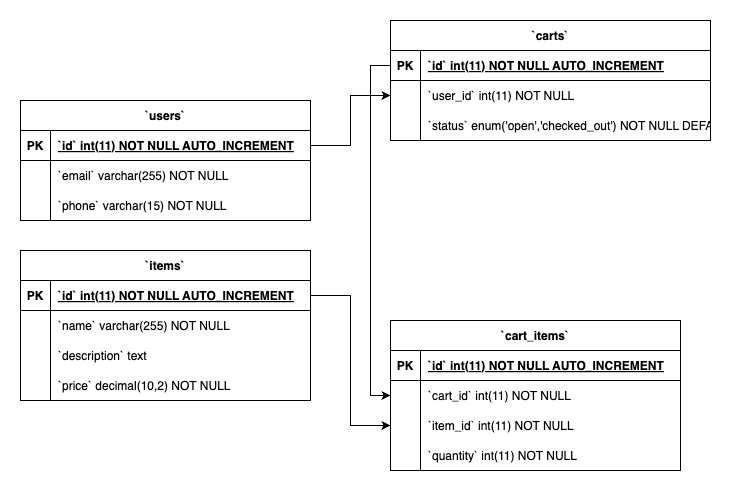

# Online Shop

This is a simple online shop built with PHP using the CodeIgniter 3.1.13 framework and MySQL.



## Requirements

- PHP 8.1.29 (CodeIgniter 3.1.13 supports PHP versions 5.6 or newer, but PHP 7.3 or newer is recommended. It should also work on PHP 8.1.29, but if you encounter any issues, you might need to downgrade your PHP version to 7.x.)
- MySQL 5.7 or higher

## Installation

1. Clone this repository to your local machine.
2. Navigate to the project directory.

## Database Setup

This project uses CodeIgniter's migration feature to set up the database.

1. Open the `application/config/database.php` file and update the database settings. If you're using MacOS, the hostname should be `127.0.0.1`. If you're using Windows, you can use `localhost`.
2. Create tables manually using SQL, here is the SQL syntax for creating tables (replace with your actual SQL syntax).

```sql
CREATE TABLE `users` (
  `id` int(11) NOT NULL AUTO_INCREMENT,
  `email` varchar(255) NOT NULL,
  `phone` varchar(15) NOT NULL,
  PRIMARY KEY (`id`),
  UNIQUE KEY `email` (`email`),
  UNIQUE KEY `phone` (`phone`)
) ENGINE=InnoDB DEFAULT CHARSET=utf8;

CREATE TABLE `items` (
  `id` int(11) NOT NULL AUTO_INCREMENT,
  `name` varchar(255) NOT NULL,
  `description` text,
  `price` decimal(10,2) NOT NULL,
  PRIMARY KEY (`id`)
) ENGINE=InnoDB DEFAULT CHARSET=utf8;

CREATE TABLE `carts` (
  `id` int(11) NOT NULL AUTO_INCREMENT,
  `user_id` int(11) NOT NULL,
  `status` enum('open','checked_out') NOT NULL DEFAULT 'open',
  PRIMARY KEY (`id`),
  KEY `user_id` (`user_id`),
  CONSTRAINT `carts_ibfk_1` FOREIGN KEY (`user_id`) REFERENCES `users` (`id`)
) ENGINE=InnoDB DEFAULT CHARSET=utf8;

CREATE TABLE `cart_items` (
  `id` int(11) NOT NULL AUTO_INCREMENT,
  `cart_id` int(11) NOT NULL,
  `item_id` int(11) NOT NULL,
  `quantity` int(11) NOT NULL,
  PRIMARY KEY (`id`),
  KEY `cart_id` (`cart_id`),
  KEY `item_id` (`item_id`),
  CONSTRAINT `cart_items_ibfk_1` FOREIGN KEY (`cart_id`) REFERENCES `carts` (`id`),
  CONSTRAINT `cart_items_ibfk_2` FOREIGN KEY (`item_id`) REFERENCES `items` (`id`)
) ENGINE=InnoDB DEFAULT CHARSET=utf8;
```

## Endpoints

| Endpoint                    | HTTP Method | Description                        |
|-----------------------------|-------------|------------------------------------|
| `/index.php/register`       | POST        | Register a new user                |
| `/index.php/item/create`    | POST        | Add a new item                     |
| `/index.php/item/update/{id}`| PUT       | Update an existing item            |
| `/index.php/cart/create`    | POST        | Create a new cart                  |
| `/index.php/cart/checkout/{id}`| PUT     | Checkout a cart                    |
| `/index.php/cart/history/{id}`| GET      | Get a user's shopping history      |
| `/index.php/cartitem/create`| POST       | Add an item to a cart              |

## Using the Endpoints

# User Registration

- **Endpoint URL:** `http://localhost:8080/index.php/UserController/register`
- **HTTP Method:** POST
- **JSON Request Body:**

```json
{
    "email": "user@example.com",
    "phone": "1234567890"
}
```

# Item Creation

- **Endpoint URL:** `http://localhost:8080/index.php/ItemController/create`
- **HTTP Method:** POST
- **JSON Request Body:**

```json
{
    "name": "Item Name",
    "price": 100.00
}
```

# Item Update

Endpoint URL: http://localhost:8080/index.php/ItemController/update/{id} (Replace {id} with the actual item ID)
- **Endpoint URL:** `http://localhost:8080/index.php/ItemController/update/{id}` (Replace `{id}` with the actual item ID)
- **HTTP Method:** PUT
- **JSON Request Body:**

```json
{
    "name": "New Item Name",
    "price": 150.00
}
```

# Cart Creation

- **Endpoint URL:** `http://localhost:8080/index.php/CartController/create`
- **HTTP Method:** POST
- **JSON Request Body:**

```json
{
    "user_id": 1
}
```

# Cart Checkout

- **Endpoint URL:** `http://localhost:8080/index.php/CartController/checkout/{id}` (Replace `{id}` with the actual cart ID)
- **HTTP Method:** PUT

# Shopping History

- **Endpoint URL:** `http://localhost:8080/index.php/CartController/history/{userId}` (Replace `{userId}` with the actual user ID)
- **HTTP Method:** GET

# Add Item to Cart

- **Endpoint URL:** `http://localhost:8080/index.php/CartItemController/create`
- **HTTP Method:** POST
- **JSON Request Body:**

```json
{
    "cart_id": 1,
    "item_id": 1,
    "quantity": 2
}
```

# Running the Application

To start the application, navigate to the project directory and run `php -S localhost:8080`. Then, open your web browser and navigate to [http://localhost:8080](http://localhost:8080).

Please note that you need to have PHP installed on your machine to run the server. If you don’t have PHP installed, you can use XAMPP or any other local server environment. If you’re using XAMPP, place the project folder in the `htdocs` directory of your XAMPP installation.

# Contributing

Pull requests are welcome. For major changes, please open an issue first to discuss what you would like to change.
